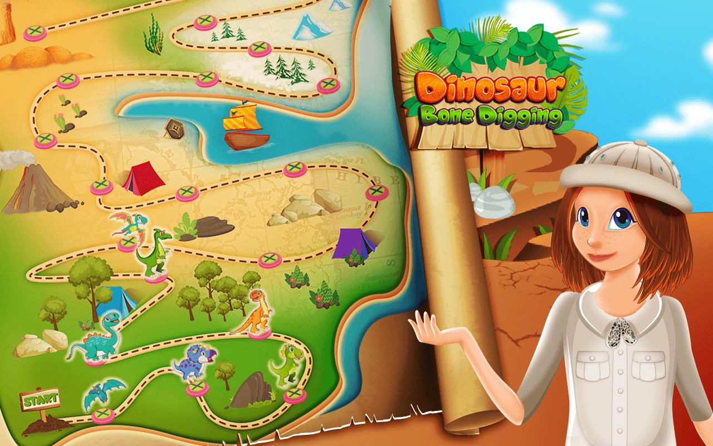
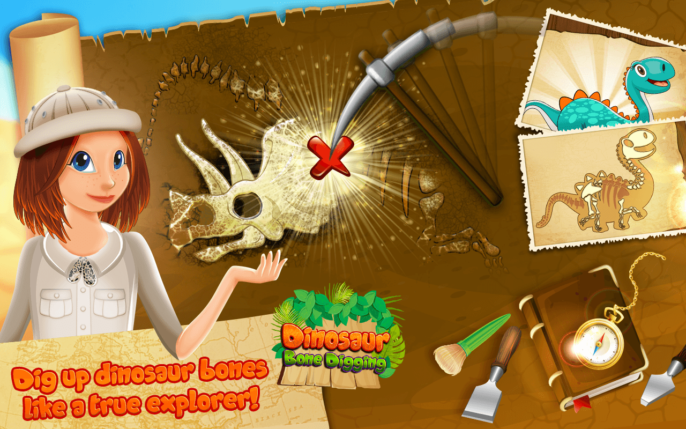
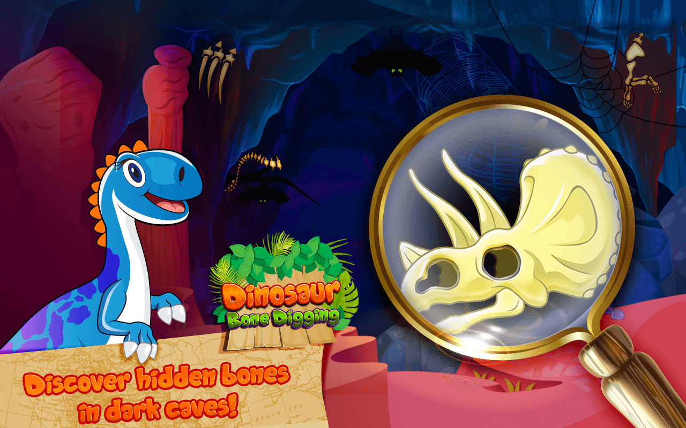
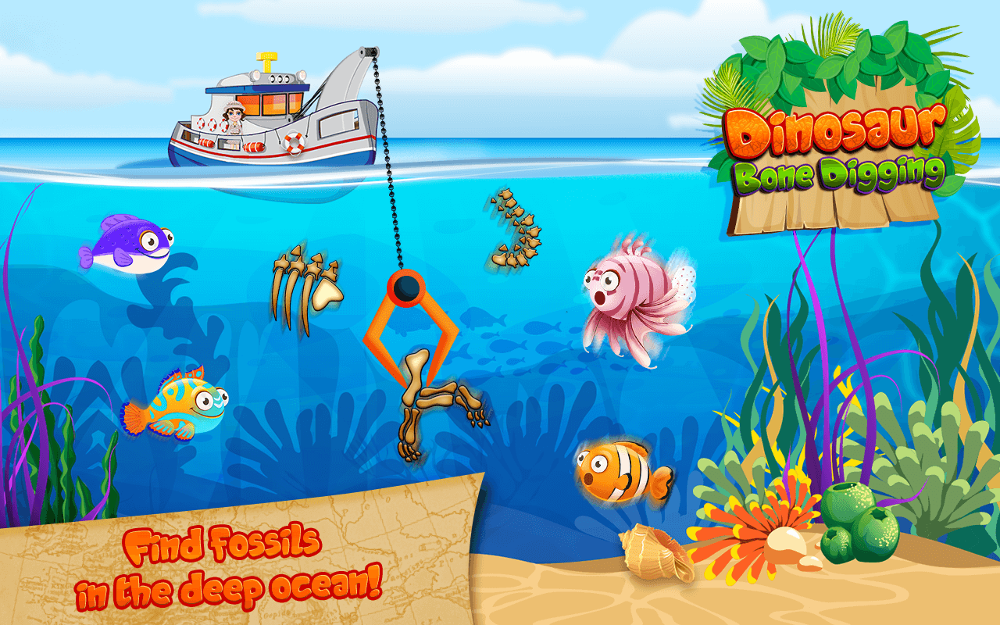
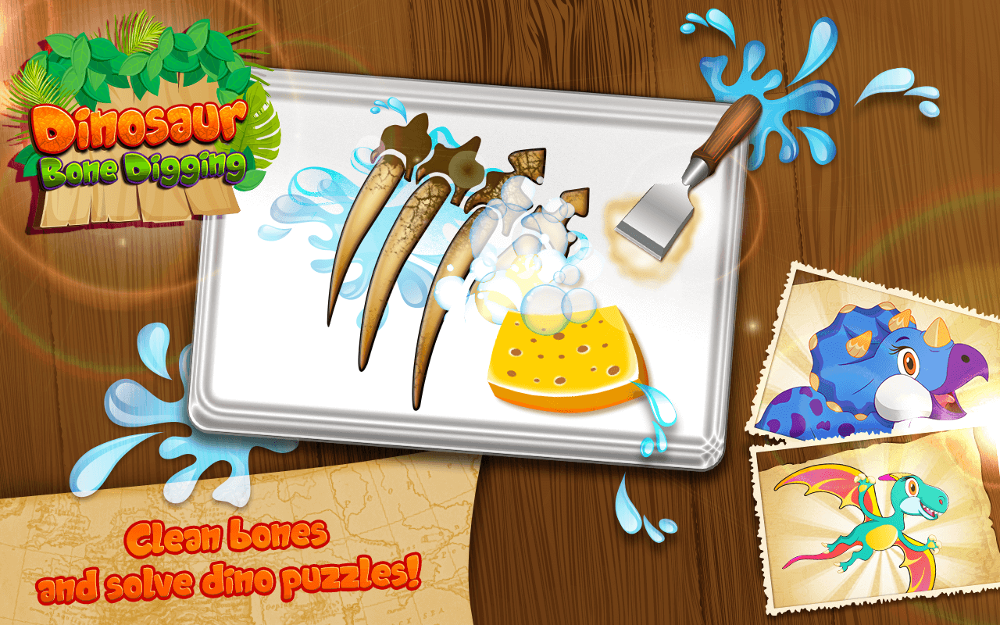

# Bone-Digging

  
  
  
  
  

## Features
  * 4 ways to collect bones and solve the dino puzzle:
    * 1.DIGGING UP BONES – dig up holes and excavate dinosaur bones!
    * 2. FISHING FOR BONES – fish out fossils from the ocean!
    * 3. EXPLORING THE CAVES – use a flashlight to discover the bones in the dark
    caves!
    * 4. CLEANING THE BONES – clean the bones using special tools and then arrange
    the bones into a dino puzzle!

  * MINI GAMES – 2 exciting mini games you can play in order to proceed to the next level,
  once your dinosaur puzzle is completed!

## [DOCUMENTATION](https://github.com/spatel210/Bone-Digging/blob/main/BoneDigging.pdf)
